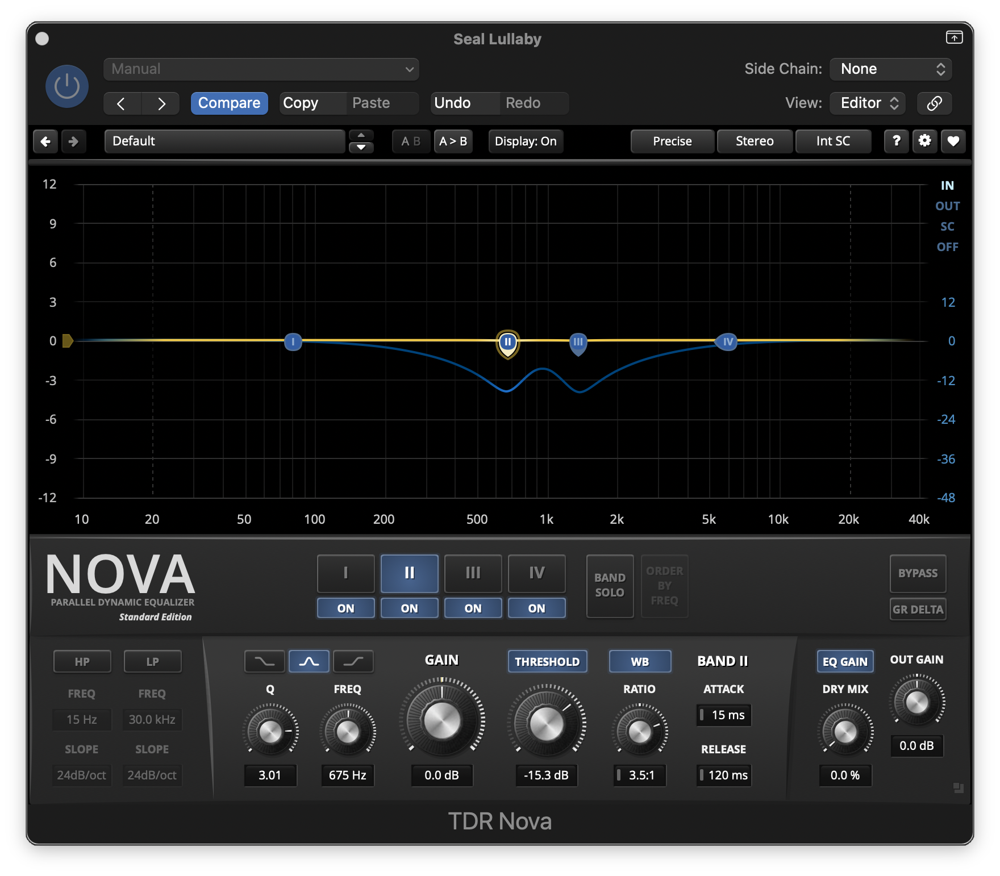

import { Steps, Tabs, TabItem, Aside } from '@astrojs/starlight/components';

**The problem:** on high, loud notes, a few high voices (usually sopranos) jump out of the blend and sound piercing. The rest of the time the balance is fine.

## Options

<Tabs>
  <TabItem label="Dynamic EQ: TDR Nova ✅">
    **✅ Current choice (since 2026-10-03).** An EQ band that only cuts when that frequency range gets loud, and does nothing the rest of the time.
    - ✅ Turns down *just the offending frequencies*, so the lower voices, piano and room stay untouched.
    - ✅ Automatic: it catches every peak, including ones you'd miss.
    - ✅ [TDR Nova](https://www.tokyodawn.net/tdr-nova/) is free (paid *GE* version has more features).
    - ❌ Easy to overdo, which dulls the sopranos everywhere. Check with bypass.
  </TabItem>
  <TabItem label="Volume automation (previous method)">
    Draw volume dips on the whole track at each loud high note.
    - ✅ Simple, built into Logic, and fully in your control.
    - ❌ Turns down **everything**, including the other voices, piano and room, so the dip can be audible.
    - ❌ Slow, with one hand-drawn dip per peak.
    - Still useful for a one-off moment that dynamic EQ can't fix cleanly.
  </TabItem>
  <TabItem label="Static EQ cut">
    A fixed Channel EQ cut in the harsh range.
    - ❌ Cuts all the time, so the sopranos sound dull in quiet passages. Only use it if the harshness is constant.
  </TabItem>
  <TabItem label="Multiband compressor">
    Logic's **Multipressor** compresses a frequency band.
    - Similar idea, but with broader bands and less precise control than a dynamic EQ band.
  </TabItem>
</Tabs>

## TDR Nova setup

<Steps>
1. **Insert** TDR Nova on the song's track, **after** clean-up and EQ and **before** compression and the reverb send. That way the reverb doesn't get the piercing peaks either.
2. **Find the frequency.** Loop a loud high passage. Enable one band, boost it, and sweep while using the band's solo/listen to find where the piercing sound lives. Check **two places**: the *fundamental* of the high notes (about **600 Hz–1.1 kHz**, which is where it was on [Seal Lullaby](#worked-example-seal-lullaby)) and the *harshness* range (about **1.5–4 kHz**). Then set the gain back to 0.
3. **Make it dynamic.** Turn on the band's **threshold** (dynamic mode). Use a moderate **Q** (about 1–2) so the cut is not too narrow, and a ratio of about **2–4:1**.
4. **Set the threshold** so the band only moves on the problem notes. Watch the band's gain-reduction display, which should sit at 0 dB most of the time and dip on the peaks.
5. **Attack / release.** Use a fairly fast attack (5–15 ms) to catch the note, and a medium release (100–250 ms) so it doesn't pump.
6. **Amount:** aim for **2–5 dB** reduction on the worst notes. If you need much more, look at the source instead (mic position, or the singer's distance).
7. **A/B with bypass**, at matched level, across the whole song. Quiet passages should sound identical. Only the peaks should change.
8. **Save a preset** (e.g. `Ascolta – soprano peaks`) and note the settings in the concert log.
</Steps>

<Aside type="tip">
TDR Nova's gain-reduction display is a great way to *see* when the singers hit the problem notes. If it's dipping constantly, the threshold is too low.
</Aside>

## Worked example: *Seal Lullaby*

| Setting | Band II |
|---|---|
| Shape | Bell |
| Frequency | **675 Hz** |
| Q | 3.01 |
| Static gain | 0.0 dB (purely dynamic) |
| Threshold | −15.3 dB |
| Ratio | 3.5:1 |
| Attack / Release | 15 ms / 120 ms |
| Max reduction seen | about 4 dB |

**What this taught us:** the problem was the **fundamental** of the high soprano notes, not the 2–4 kHz "harshness" range. 675 Hz is about E5/F5, the top of the soprano line. The Q of about 3 is narrower than the general starting advice, which works here because it targets those specific notes. A second band (III), at roughly 1.3–1.5 kHz, catches the first harmonic. *Band III's settings are to be added from the next screenshot.*

## To learn
- [ ] Record the frequency, threshold and amount that worked, per concert or venue.
- [ ] Try a second band if the altos or a soloist have their own problem range.
- [ ] Decide whether the paid TDR Nova GE features are worth it.
